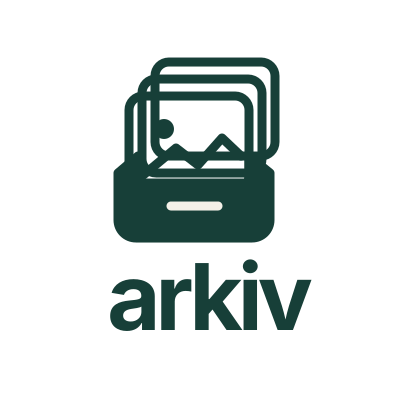

# arkiv



**Your photos, at home.**

A self-hosted photo and video library with a mobile-friendly gallery, maps, shared albums and private uploads. One container runs the Go server, embedded Vue interface, SQLite database and media tools.

[Setup](#docker-deployment) · [Configuration](docs/CONFIGURATION.md) · [Accounts & sharing](docs/ACCOUNTS.md) · [Maps & privacy](docs/MAPS.md) · [Verification](docs/VERIFICATION.md)

## Features

- Browse photos and videos by date, folder, favorite or place; search filenames and metadata.
- Upload photos, camera RAW files and videos with resumable transfers and duplicate detection.
- Organize personal folders, share with other users, or create public album links with access settings and expiry.
- Hold and drag to select on mobile. Swipe through the fullscreen viewer, pinch to zoom, and swipe down to close.
- View browser-supported original images at full resolution. Other supported images use full-size PNG rendering; RAW appearance depends on the installed decoder.
- Play original videos, or request a compatible H.264/AAC copy when needed.
- Inspect indexing, preview failures and cache usage in **Processing**.

arkiv is under active development. Current validation coverage and known limitations are recorded in [Verification](docs/VERIFICATION.md).

## Docker deployment

Requirements: Docker Engine with Compose v2, a photo directory, and writable data and cache directories.

### Configuration

Create `.env` from the supplied template:

```sh
cp .env.example .env
```

Example NAS configuration:

```dotenv
ARKIV_IMAGE=ghcr.io/brendlij/arkiv:latest
ARKIV_PHOTOS_DIR=/volume1/photos
ARKIV_DATA_DIR=/volume1/docker/arkiv/data
ARKIV_CACHE_DIR=/volume1/docker/arkiv/cache
ARKIV_HOST_PORT=8090
TZ=Europe/Berlin
```

The container runs as **UID/GID 10001:10001** and requires write access to the data and cache directories plus read and traverse access to the photo directory. Bind paths must exist before startup. The photo mount remains read-only.

The Compose file pulls `ghcr.io/brendlij/arkiv` and uses `/photos`, `/data` and `/cache` inside the container. Host paths are configured through `.env`. A numbered image tag such as `ghcr.io/brendlij/arkiv:0.2.0` provides reproducible deployments; `latest` tracks the newest release.

### Initial account

```sh
docker compose pull
```

Generate an Argon2id hash from a password of at least 12 characters:

```bash
read -rs -p 'arkiv password: ' ARKIV_SETUP_PASSWORD
printf '\n'
printf '%s\n' "$ARKIV_SETUP_PASSWORD" | docker run --rm -i ghcr.io/brendlij/arkiv:latest hash-password
unset ARKIV_SETUP_PASSWORD
```

Set the initial administrator and generated hash in `.env`. Single quotes preserve the dollar signs:

```dotenv
ARKIV_USERNAME=admin
ARKIV_PASSWORD_HASH='$argon2id$v=19$m=65536,t=3,p=2$YOUR_SALT$YOUR_HASH'
```

These settings seed the first administrator only. Later password changes are managed through **My account**.

### Startup

```sh
docker compose config --quiet
docker compose up -d
docker compose logs -f arkiv
```

The interface is available at **http://SERVER-IP:8090**. The configured port must be permitted by the host firewall.

HTTPS reverse proxies require `ARKIV_SECURE_COOKIES=true`, preservation of the original Host header, and an upload body allowance of at least 8 MiB. Trusted-proxy authentication requires explicit trusted network configuration; see [Configuration](docs/CONFIGURATION.md).

## Storage layout

| Location in the container | Contents                                                        | Back up?        |
| ------------------------- | --------------------------------------------------------------- | --------------- |
| `/photos`                 | Existing external originals, mounted read-only                  | Yes, separately |
| `/data/gallery.db`        | Users, permissions, albums, favorites, metadata and jobs        | Yes             |
| `/data/uploads/`          | Uploaded originals, paused transfers and quarantine             | Yes             |
| `/cache`                  | Rebuildable thumbnails, full-size renders and compatible videos | Optional        |

The database filename remains `gallery.db` for installation compatibility. Files inside `uploads/` are application-managed.

**My library** contains managed uploads. **Photos** also includes shared media and accessible server libraries. Folder moves change organization in arkiv without changing external storage paths.

Uploaded files can be trashed, restored or permanently deleted. Removing shared or external-library media hides it from the current account without deleting the original. Folder sharing includes descendants. Administrators can view non-trashed media. See [Accounts & sharing](docs/ACCOUNTS.md) for the access model.

## Uploads, processing and quality

Uploads accept up to **50 files per batch**, **250 MiB per photo/RAW**, and **2 GiB per video**. The default allowance is **5 GiB per user**, adjustable in People & access. Interrupted uploads use 8 MiB chunks and resume when the same original is selected again. Full-file SHA-256 verification happens before acceptance.

Supported extensions are listed in the upload dialog. Accepting a format does not guarantee that every camera variant or codec can be decoded by the installed media tools. Failed previews leave the original available for download.

External libraries scan on startup and every 30 minutes by default; uploads are indexed immediately. **Processing** shows progress and failures and lets administrators retry work. External file renames are currently treated as removal plus new discovery, so album/favorite associations do not follow them.

The viewer loads original images where the browser supports them. Full-size PNG conversion does not resize images; RAW development is not guaranteed to match another editor's colors. Compatible video conversion uses H.264/AAC and preserves resolution with possible one-pixel padding. It is not an original-quality replacement; original downloads remain available. Public-album playback retains its own access-controlled behavior.

Cache maintenance runs at startup and hourly. It removes obsolete generated files older than 24 hours, expires full-size image/video copies after 30 idle days, and requeues missing previews. **Check & clean cache** runs the same maintenance manually. Originals and Trash are not automatically purged. Cache retention is age-based; a hard cache byte limit and free-disk guarantees are not implemented.

## Backup and upgrades

Backups must include the complete data directory and external originals. Stop arkiv before copying the data directory to keep SQLite and WAL files consistent:

```sh
docker compose stop arkiv
# Back up ARKIV_DATA_DIR and the external photo library.
docker compose start arkiv
```

Upgrade procedure:

```sh
docker compose pull
docker compose up -d
```

Database migrations run automatically. Binary-only rollback after a migration is unsupported; restore the matching data backup with the previous image. Restore tests are recommended for production backup plans.

Architecture, configuration, verification, and release documentation are available in [docs](docs/).
